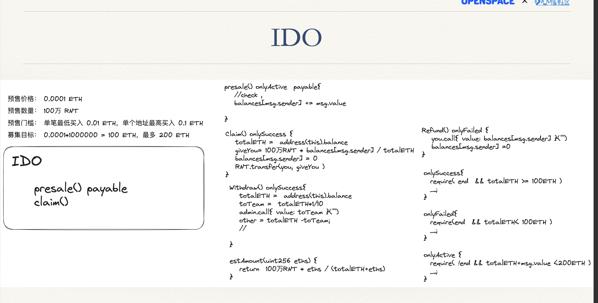
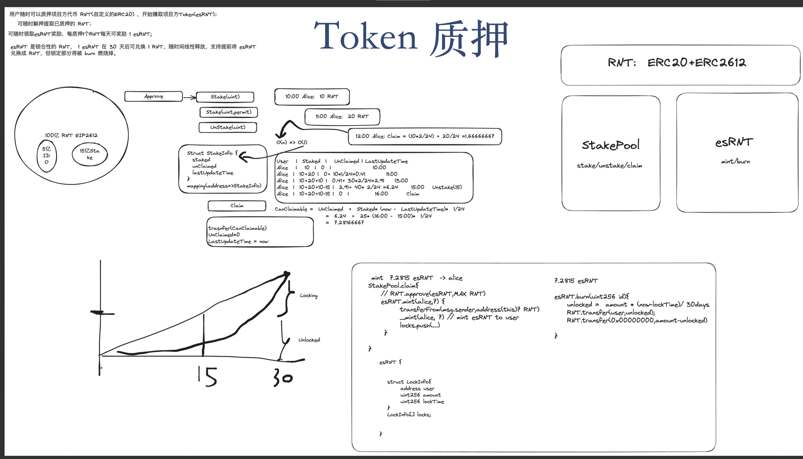

## Task1
>编写 IDO 合约，实现 Token 预售，需要实现如下功能：
>- 开启预售: 支持对给定的任意ERC20开启预售，设定预售价格，募集ETH目标，超募上限，预售时长。
>- 任意用户可支付ETH参与预售；
>- 预售结束后，如果没有达到募集目标，则用户可领会退款；
>- 预售成功，用户可领取 Token，且项目方可提现募集的ETH

### 实现
[ido.md](./files/ido.md)

---

## Task2
>编写一个质押挖矿合约，实现如下功能：
>- 用户随时可以质押项目方代币 RNT(自定义的ERC20) ，开始赚取项目方Token(esRNT)；
>- 可随时解押提取已质押的 RNT；
>- 可随时领取esRNT奖励，每质押1个RNT每天可奖励 1 esRNT;
>- esRNT 是锁仓性的 RNT， 1 esRNT 在 30 天后可兑换 1 RNT，随时间线性释放，支持提前将 esRNT 兑换成 RNT，但锁定部分将被 burn 燃烧掉

### 实现
[stake.md](./files/stake.md)

