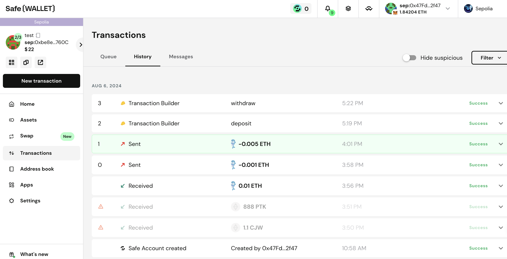

## Task1

### description
实现⼀个简单的多签合约钱包，合约包含的功能：
1. 创建多签钱包时，确定所有的多签持有⼈和签名门槛
2. 多签持有⼈可提交提案
3. 其他多签⼈确认提案（使⽤交易的⽅式确认即可）
4. 达到多签⻔槛、任何⼈都可以执⾏交易

### code
[MultisigWallet.sol](./src/MultisigWallet.sol)

### test
[MultisigWalletTest.sol](./test/MultisigWalletTest.sol)

### test result
[MultisigWalletTest.log](./test/MultisigWalletTest.log)

## Task2
在 Safe Wallet 支持的测试网上创建一个 2/3 多签钱包。
然后：
1. 往多签中存入自己创建的任意 ERC20 Token。
2. 从多签中转出一定数量的 ERC20 Token。
3. 把 Bank 合约的管理员设置为多签。
4. 贴 Safe 的钱包链接。
5. 从多签中发起， 对 Bank 的 withdraw 的调用

### result
Safe 钱包地址: 0xbe8eBF3Dea944604eFcdE8572d720b22b905760C

交易记录: https://sepolia.etherscan.io/address/0xbe8eBF3Dea944604eFcdE8572d720b22b905760C

